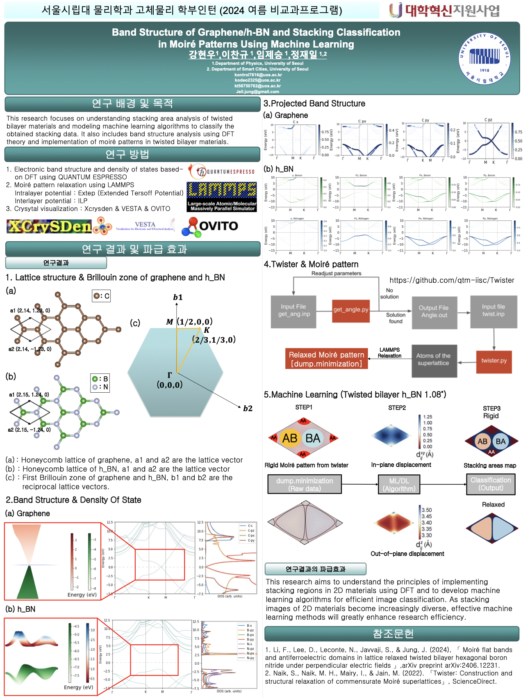
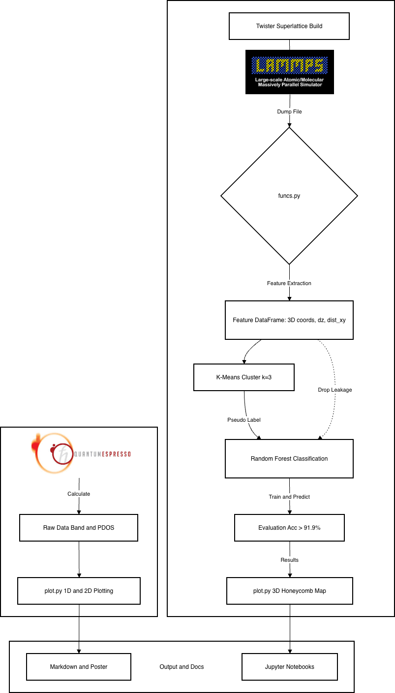

# 2024 UOS Physics Internship



---

## Architecture



---

## Directory Structure

```
2024_UOS_Physics/
├── data/
│   ├── graphene_band_structure.gnu       # Graphene 밴드구조 (QE 출력)
│   ├── graphene_total_pdos.dat           # Graphene 전체 PDOS
│   ├── graphene_pdos_C1_s.dat            # C1 원자 궤도 s PDOS
│   ├── graphene_pdos_C1_p.dat            # C1 원자 궤도 p PDOS
│   ├── graphene_pdos_C2_s.dat            # C2 원자 궤도 s PDOS
│   ├── graphene_pdos_C2_p.dat            # C2 원자 궤도 p PDOS
│   ├── graphene_3d_bands_layer4.dat      # 3D 밴드구조 데이터 (layer 4)
│   ├── graphene_3d_bands_layer5.dat      # 3D 밴드구조 데이터 (layer 5)
│   ├── graphene_3dbands_sm_4.dat         # Smoothed 3D 밴드구조 (layer 4)
│   ├── graphene_3dbands_sm_5.dat         # Smoothed 3D 밴드구조 (layer 5)
│   ├── hbn_band_structure.gnu            # h-BN 밴드구조 (QE 출력)
│   ├── hbn_total_pdos.dat                # h-BN 전체 PDOS
│   ├── hbn_pdos_tot_v2.dat               # h-BN 전체 PDOS v2
│   ├── hbn_pdos_B_s.dat                  # B 원자 궤도 s PDOS
│   ├── hbn_pdos_B_p.dat                  # B 원자 궤도 p PDOS
│   ├── hbn_pdos_N_s.dat                  # N 원자 궤도 s PDOS
│   ├── hbn_pdos_N_p.dat                  # N 원자 궤도 p PDOS
│   ├── hbn_3d_bands_layer4.dat           # h-BN 3D 밴드구조 (layer 4)
│   ├── hbn_3d_bands_layer5.dat           # h-BN 3D 밴드구조 (layer 5)
│   ├── hbn2_3dbands_4.dat                # h-BN 3D 밴드 (System 2, layer 4)
│   ├── hbn2_3dbands_5.dat                # h-BN 3D 밴드 (System 2, layer 5)
│   ├── hbn_proj_bands.dat                # h-BN Projected 반드 구조
│   ├── hbn_lammps_dump.dat               # LAMMPS 완화 결과 (ML 입력)
│   ├── hbn_superlattice_coordinates.dat  # 초격자 좌표
│   ├── hbn_twist_input.inp               # Twister 입력 파라미터 (θ = 1.08°)
│   ├── hbn_input_parameters.txt          # 메인 입력 파라미터 데이터
│   ├── bands.dat.gnu                     # 기타 밴드구조 1
│   └── bands.dat(1).gnu                  # 기타 밴드구조 2
├── img/
│   ├── result/                           # 완성된 시각화 디렉토리
│   └── visualization/                    # 시각화 분석 디렉토리
├── src/
│   ├── __init__.py                       # 패키지 구성을 위한 파일
│   ├── twister.py                        # 초격자 좌표 생성
│   ├── funcs.py                          # 파싱·피처 추출 유틸
│   ├── tovasp.py                         # VASP 포맷 변환
│   └── plot.py                           # 시각화 CLI 모듈
├── Notebook.ipynb                        # 메인 머신러닝 분석 노트북
├── graphene_band_structure.ipynb         # Graphene 밴드구조 스터디 노트 (메인 노트북 참고용)
├── requirements.txt                      # 환경 패키지 목록
└── README.md                             # 메인 README.md
```

---

본 프로젝트는 '트위스티드 이중층 h-BN(Twisted Bilayer h-BN)'의 Moiré 패턴 시뮬레이션 데이터를 머신러닝(ML) 앙상블 기법으로 분석하여 스태킹 도메인(Stacking Domain, AA/AB/BA)을 자동 분류하고 검증하는 자동화 시스템 구축을 목표로 진행되었습니다. 기존 고체물리 연구에서는 초기 초격자(Superlattice) 구축 후 LAMMPS 등 텍스트 기반 덤프(Dump) 파일로 추출되는 수만 개 원자의 3D 좌표를 육안 및 수작업으로 파싱해야 했으며, 브루트포스(Brute-force, $O(N^2)$) 방식의 계산 구조로 인해 대규모 시스템 분석 시 심각한 연산 과부하가 발생했습니다. 이에 본 연구는 단순 3D 좌표 변수만으로도 물리적인 특성 분포를 정확히 묶어낼 수 있도록 전처리(Parsing)-군집화(K-Means)-교차평가(Random Forest)-벌집 맵 시각화에 이르는 일련의 데이터 사이언스 파이프라인을 설계했습니다.

특히 머신러닝 방법론 적용에 있어, 평가 모델(RF) 학습 시 사전 군집화의 핵심 지표가 되는 파생 변수(dz, dist_xy)가 필연적으로 데이터 누수(Data Leakage)를 유발함을 Feature Importance 분석을 통해 논리적으로 진단하고 과감히 배제했습니다. K-Means의 비지도(Unsupervised) 클러스터 방식으로 도메인 간의 Pseudo-Label을 형성한 후, 이를 다시 누수 변수가 차단된 가장 엄격한 차원(순수 공간 좌표)에서 앙상블 트리에 투입하여 분류 성능을 검증했습니다. 또한 SciPy 라이브러리의 cKDTree 알고리즘을 도입해 물리적인 최단 이웃 탐색 복잡도를 $O(N\log N)$ 스케일로 최적화함으로써 11,164개 원자 연산에 소요되는 시간을 수백 배(0.8초 $\rightarrow$ 0.002초) 이상 비약적으로 고속화하는 성과를 이뤘습니다.

결과적으로, 새롭게 고안한 Baseline 모델은 오버피팅과 데이터 누수 요소가 전혀 없는 투명한 조건 아래서도 91.94%에 육박하는 높은 Test Accuracy를 기록하며 Moiré 패턴의 이론적 격자 완화(Lattice relaxation) 도메인 특성 비율을 완벽하게 재구성했습니다. 이는 기존의 수작업 개입과 개별 스크립트에 의존하던 데이터 분석 및 시각화 과정을 몇 초 내로 완결 짓는 하나의 End-to-End 자동화 파이프라인(Object-Oriented Module)으로 추상화하였음을 뜻합니다. 궁극적으로 이번 결과물은 향후 서로 다른 비틀림 각도(Twist Angle)를 갖거나 훨씬 방대한 스케일의 2차원 물질(Graphene 등) 시스템이 도래하더라도 수정 비용 없이 그 기하학적 분포 특성을 즉시 판독해 낼 수 있는, 소재 정보학(Materials Informatics) 관점에서의 유연한 솔루션 프레임워크를 구축하였다는 데 큰 의의가 있습니다.

---

## Conclusion

### ML Classification (Twisted Bilayer h-BN θ = 1.08°)

| 항목 | 값 |
|------|-----|
| 데이터 | LAMMPS dump, 최종 프레임 (timestep 855), **11,164 atoms** |
| 레이어 분리 | lower B/N (type 1+2): 5,582개 / upper B/N (type 3+4): 5,582개 |
| 층간 거리 (interlayer Δz) | **3.273 Å** |
| ML 모델 | Random Forest (n_estimators=200, 5-fold CV) |
| **Test Accuracy** | **91.94%** (Data Leakage 배제 기준) |
| **5-fold CV** | **26.24% ± 4.89%** |

### Stacking Domain Distribution

| 도메인 | 원자 쌍 수 | 비율 | 물리적 의미 |
|--------|-----------|------|------------|
| **AA** | 571 | 10.2% | 두 layer 원자 완전 겹침 — 층간 반발 최고 |
| **AB** | 2,551 | 45.7% | 하층 B 위에 상층 N — 안정 스태킹 |
| **BA** | 2,460 | 44.1% | AB 거울 대칭 — 안정 스태킹 |

> AA 영역이 가장 좁고(10%), 안정 상태인 AB/BA가 90%를 차지하며  
> 이는 참고논문(Li et al. 2024)의 lattice relaxation 이론과 일치합니다.

---

## References

1. Li, F., Lee, D., Leconte, N., Javvaji, S., & Jung, J. (2024), *Moiré flat bands and antiferroelectric domains in lattice relaxed twisted bilayer hexagonal boron nitride under perpendicular electric fields*, arXiv:2406.12231
2. Naik, S. et al. (2022). *Twister: Construction and structural relaxation of commensurate Moiré superlattices*, ScienceDirect
3. Quantum ESPRESSO: [quantum-espresso.org](https://www.quantum-espresso.org)
4. LAMMPS: [lammps.org](https://www.lammps.org)
