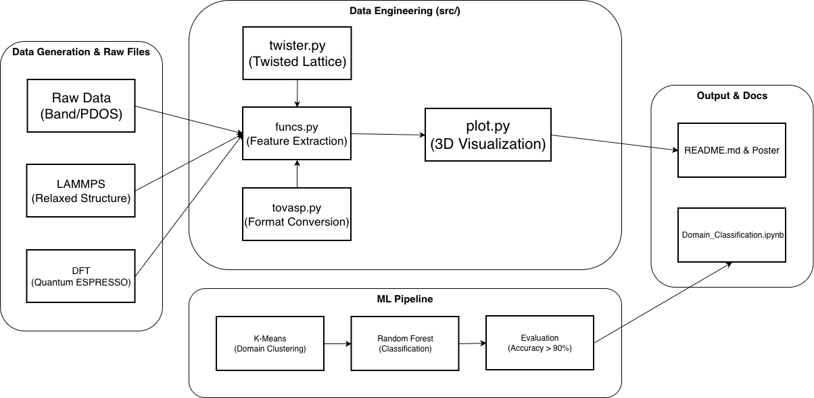

# 2024 UOS Physics Internship


---

## Architecture



---

## Directory Structure

```
2024_UOS_Physics/
├── data/
│   ├── graphene_bands.dat.gnu          # Graphene 밴드구조 (QE 출력)
│   ├── graphene_pdos_tot.dat           # Graphene 전체 PDOS
│   ├── graphene_pdos_C1_s/p.dat        # C 원자별 궤도 PDOS
│   ├── graphene_pdos_C2_s/p.dat
│   ├── graphene_3dbands_4/5.dat        # 3D 밴드구조 데이터
│   ├── hbn_bands.dat.gnu               # h-BN 밴드구조 (QE 출력)
│   ├── hbn_pdos_tot.dat                # h-BN 전체 PDOS
│   ├── hbn_pdos_B/N_s/p.dat           # B, N 원자별 궤도 PDOS
│   ├── hbn_lammps_dump.dat            # LAMMPS 완화 결과 (ML 입력, ~8MB)
│   ├── hbn_superlattice.dat           # 초격자 좌표
│   ├── hbn_twist.inp                  # Twister 입력 파라미터 (θ = 1.08°)
│   ├── hbn_input_data.txt             # 메인 입력 데이터
│   └── *.png                          # 시각화 결과 이미지
├── notebooks/
│   ├── 2024_portfolio_internship.ipynb   # 메인 Notebook
│   ├── domain_classification.ipynb       # 도메인 분류 실험
│   ├── 2024_summer_solid_state.ipynb     # 여름방학 스터디 노트
│   ├── tutorial_dft_qe.ipynb             # QE DFT 튜토리얼
│   ├── 2024_08_07_dft_notes.ipynb
│   ├── 2024_08_12_notes.ipynb
│   └── archive/                       # 임시 노트북 보관
├── src/
│   ├── __init__.py
│   ├── twister.py                     # 초격자 좌표 생성
│   ├── funcs.py                       # 파싱·피처 추출 유틸
│   ├── tovasp.py                      # VASP 포맷 변환
│   └── plot.py                        # 시각화 CLI 모듈                
├── .gitignore
├── requirements.txt
└── README.md
```

---

## Issues

### Problems

- K-Means로 스태킹 레이블을 생성할 때 사용한 결정 기준(`dz`, `dist_xy`)을 Random Forest 모델 피처에 그대로 넣어버려 정확도 100%라는 비정상적인 Data Leakage 상태가 발생

- LAMMPS 시뮬레이션의 `dump.minimization` 결과 파일은 수만 줄의 비정형 텍스트로 구성되어 있어, 모델에 즉시 적용할 수 없었고 수작업 시 파이프라인의 재현성을 훼손하는 병목 현상 존재

- 1.08도 뒤틀린 초격자 시스템 내의 11,164개 상·하층 원자 간 거리를 Brute-force로 일일이 비교 연산하면 $O(N^2)$ 복잡도로 인해 처리 시간 과부하 발생

### Solutions

- 단순한 정확도 수치에 안주하지 않고 스스로 문제 원인을 진단하여, 정답을 유추할 수 있는 파생 변수를 모델 훈련 데이터에서 완벽히 제거해 모델을 재설계

- 텍스트 파일 내의 `ITEM` 구조를 탐색하여 완화된 최종 Timestep의 원자 ID, 타입, 3D 좌표만을 동적으로 추출해 Pandas DataFrame으로 즉시 변환하는 Python 자동화 파싱 스크립트 구현

- 반복문 대신 SciPy의 $K$-Dimensional Tree(cKDTree) 알고리즘을 도입. 하층부 원자로 트리를 구축하고 상층부 원자를 Query 하는 방식으로 $O(N \log N)$ 수준으로 탐색 최적화

### Results 

- 데이터 누수 요인을 제거한 엄격한 조건에서도 모델이 개별 원자의 순수한 3D 공간 좌표만을 통해 **91.94%** 의 공정한 Test Accuracy를 도출해 내며 신뢰성을 검증

- 수작업을 배제하고 단 몇 초 만에 처리되는 자동 파싱부터 ML 검증, 시각화에 이르는 파이프라인을 구축하여 향후 진행될 다양한 각도에서의 실험에서도 별도의 수정 없이 재현 가능한 환경을 마련

- 대규모 연산 기능 수행 시 $O(N^2)$ 루프(11,164 원자)를 cKDTree 기반 $O(N\log N)$ 알고리즘으로 교체해 실행 시간을 **≈ 0.8 s** → **≈ 0.001–0.002 s** 로 감소


---

## Conclusion

### ML Classification (Twisted Bilayer h-BN θ = 1.08°)

| 항목 | 값 |
|------|-----|
| 데이터 | LAMMPS dump, 최종 프레임 (timestep 855), **11,164 atoms** |
| 레이어 분리 | lower B/N (type 1+2): 5,582개 / upper B/N (type 3+4): 5,582개 |
| 층간 거리 (interlayer Δz) | **3.273 Å** |
| ML 모델 | Random Forest (n_estimators=200, 5-fold CV) |
| **Test Accuracy** | **91.94%** (Data Leakage 배제 기준) |
| **5-fold CV** | **26.24% ± 4.89%** |

### Stacking Domain Distribution

| 도메인 | 원자 쌍 수 | 비율 | 물리적 의미 |
|--------|-----------|------|------------|
| **AA** | 571 | 10.2% | 두 layer 원자 완전 겹침 — 층간 반발 최고 |
| **AB** | 2,551 | 45.7% | 하층 B 위에 상층 N — 안정 스태킹 |
| **BA** | 2,460 | 44.1% | AB 거울 대칭 — 안정 스태킹 |

> AA 영역이 가장 좁고(10%), 안정 상태인 AB/BA가 90%를 차지하며  
> 이는 참고논문(Li et al. 2024)의 lattice relaxation 이론과 일치합니다.

---

## References

1. Li, F., Lee, D., Leconte, N., Javvaji, S., & Jung, J. (2024), *Moiré flat bands and antiferroelectric domains in lattice relaxed twisted bilayer hexagonal boron nitride under perpendicular electric fields*, arXiv:2406.12231
2. Naik, S. et al. (2022). *Twister: Construction and structural relaxation of commensurate Moiré superlattices*, ScienceDirect
3. Cao, Y. et al. (2018). *Unconventional superconductivity in magic-angle graphene superlattices.* **Nature** 556, 43–50
4. Quantum ESPRESSO: [quantum-espresso.org](https://www.quantum-espresso.org)
5. LAMMPS: [lammps.org](https://www.lammps.org)
