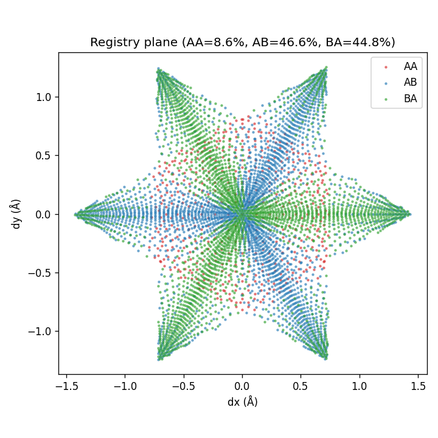
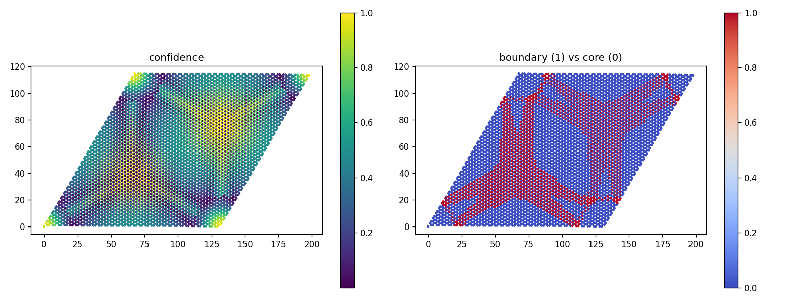
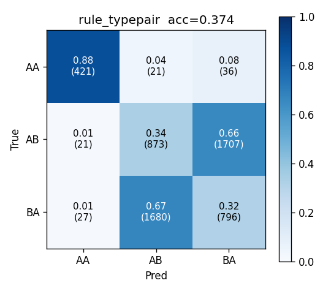
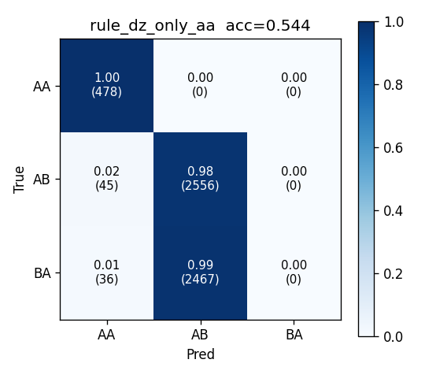

# Moiré Stacking-Domain Classification

> 트위스트 이중층 h-BN (θ ≈ 1.08°) 의 LAMMPS-relaxed 원자 좌표에서 AA / AB / BA stacking domain 을 자동 분류하는 **leakage-aware ML 파이프라인**.
> Strict-geometry track 으로 **spatial 4-block CV 98.56 % ± 2.10 %**. 모델 OOF 면적비가 [Li et al. 2024, Fig 4(i)](https://arxiv.org/abs/2406.12231) 의 θ = 1.08° BN/BN 값 (AA 10 % / AB 45 % / BA 45 %) 과 정량 일치.


| 지표 | 값 |
|------|----|
| Best model | HGB, strict feature track, spatial 4-block CV |
| Overall accuracy | **0.9856 ± 0.0210** |
| Macro F1 | 0.9881 |
| Core / Boundary accuracy | 0.9993 / 0.9493 |
| OOF area ratio (AA / AB / BA) | 8.60 % / 45.61 % / 45.79 % |
| Paper θ = 1.08° reference | ≈ 10 % / 45 % / 45 % |

---

## 0. 왜 이 문제인가

### 0-1. 도메인 분류가 왜 필요한가

t2BN 의 **거의 모든 물리량이 stacking domain 구조로 결정**됨.

| 결정되는 물리량 | 도메인 의존성 (출처) |
|------------------|----------------------|
| Flat band 폭 | AA / AB / BA 면적 비율로 bandwidth 변화 ([Paper Fig 4(g)(h)](https://arxiv.org/abs/2406.12231)) |
| Band gap | AA 면적 클수록 gap 변화 (Fig 4(e)(f)) |
| 강유전 dipole | AB / BA 의 interlayer 분극 반대 부호 (Fig 3(i)) — 면적이 net polarization 결정 |
| 전기장 응답 | E-field 가 AB / BA 면적 비대칭 변화 → switching (Fig 5(a)) |
| 인접 물질 moiré potential | 도메인 분포가 potential pattern 결정 (Fig 6) |

→ 도메인 면적비·위치 자체가 physics output. 분류는 분석의 시작점.

### 0-2. 왜 ML 인가 (단순 임계값 아닌 이유)

단일 시스템이면 사람이 임계값 잡으면 됨. ML 의 가치는 **자동화 + 확장성 + 정량 confidence**.

- **시스템마다 임계값 재튜닝 불필요**: twist angle / 정렬 / 전기장 바뀌면 `d_xy` 분포 달라짐.
- **High-throughput sweep**: E-field 부호 × 여러 θ = 수십~수백 구성, 수작업 불가.
- **Boundary 정량화**: rule = hard cutoff, ML = soft probability → soliton 영역 불확실성 측정.
- **새 시스템 일반화 평가**: 학습한 모델이 다른 θ 에 작동하는지 정량 평가 가능.
- **간접 descriptor 학습**: 직접 registry feature 없이 (예: intralayer relaxation 흔적) 도메인 복원 → 새 물리 인사이트.

**MVP 포지셔닝**: 단일 θ = 1.08° BN/BN 시스템 자동화 입증. Sweep 데이터 받으면 같은 코드 흐름 그대로 작동하는 재사용 도구.

---

## 1. 문제 정의

LAMMPS-relaxed twisted bilayer h-BN 좌표 (atom-level x, y, z) 에서 각 atom 의 stacking domain (AA / AB / BA) 자동 분류.

| 본 프로젝트 — Moiré supercell | 논문 — Fig 1(a)(b) AA/AB/BA 정의 |
|------------------------------|----------------------------------|
|  |  |

*132 Å 주기 한 개 모아레 supercell (위층 작은 점 / 아래층 큰 점). 한 셀 안에 AA, AB, BA 영역이 모자이크처럼 분포.*

기존 방법: [Li et al. 2024 Fig S.5](https://arxiv.org/abs/2406.12231) 의 in-plane displacement `d_xy` polygon rule 을 시스템마다 수작업 재구성.

**Scope**:
- **단일 θ ≈ 1.08° BN/BN MVP**.
- 면적비 곡선 ([Fig 4(i)](img/paper/fig4.png)), 전기장 sweep ([Fig 5(a)](img/paper/fig5.png)), BN/NB 정렬은 sweep 데이터 확보 후 future work.

---

## 2. 데이터

`data/hbn_lammps_dump.dat` (8 MB, 11164 atom × 10 frame). 마지막 frame (timestep 855) 만 사용.

### Data provenance 검증 — input 파일 vs dump

`hbn_twist_input.inp` 에 `angle = 6°` 적혀 있지만, dump 의 실제 cell geometry 와 불일치.

**검산** (`eda/00_box.py`):
1. LAMMPS triclinic BOX BOUNDS 보정 → `lx = xhi_bound - xy_tilt = 132.34 Å`.
2. Cell vector `A = (132.34, 0)`, `B = (66.17, 114.61)`, 사이각 60° (정확 마름모).
3. Area = 15167 Ų = 2791 × primitive cell area (`a = 2.504 Å`). ✓
4. `|A|` = moaré 주기 `L = a / (2 sin(θ/2))` → **θ = 1.0841°**.

→ 입력 파일은 stale, dump 기반 θ ≈ 1.08° 채택. 면접 시 데이터 신뢰도 검증의 기본.

---

## 3. 파이프라인 (4 phase)

### Phase 0 — EDA

- Triclinic 보정 후 layer 분리 (z < 19 Å → bottom, ≥ 19 Å → top).
- PBC-aware nearest-pair 매칭으로 `(dx, dy, dz, dist_xy, type_pair)` 계산.

| dz / dist_xy 분포 | spatial color map |
|--------------------|--------------------|
|  |  |

- **dz bimodal**: 3.23~3.27 Å peak (AB/BA 안정 stack) + 3.30~3.55 Å 꼬리 (AA 반발 stack).
- Moiré 셀 corner 에 AA hotspot (PBC 로 인해 1 AA 영역이 4 꼭짓점에 분산).

### Phase 1 — Labeling

`src/labeling.py` / `scripts/run_labeling.py`. (자세한 라벨러 시행착오는 §6-2 참조)

| 라벨 | 정의 |
|------|------|
| **AA** | same-sublattice pair (`1→3` or `2→4`) AND `dz > q90` |
| **AB** | cross-sublattice pair `2→3` (bot-N, top-B 직상) OR (same-sub low-dz AND sector ∈ {0, 2, 4}) |
| **BA** | cross-sublattice pair `1→4` (bot-B, top-N 직상) OR (same-sub low-dz AND sector ∈ {1, 3, 5}) |

- AB/BA sector convention 은 cross-sub atom 분포에서 자동 학습 (alternation 검증).
- `smooth_labels` (k = 15 NN majority vote, PBC-aware) 로 tied-pair sublattice 노이즈 제거.
- **Confidence** + **boundary (q25 컷)** 정의로 soliton 영역 정량화.
- **Spatial block**: fractional 좌표 2×2 분할 → 4 block (각 ~1390 atom).

라벨 분포:

| 라벨 | 본 프로젝트 | Paper θ = 1.08° |
|------|-------------|------------------|
| AA | 8.56 % | ≈ 10 % |
| AB | 46.60 % | ≈ 45 % |
| BA | 44.84 % | ≈ 45 % |

### Phase 2 — Feature engineering (3-track)

`src/features.py` / `scripts/build_features.py`. (왜 3-track 인지 §6-3 참조)

| Track | Cols | 포함 | 목적 |
|-------|------|------|------|
| **strict** | 20 | bottom NN 거리·각도, top 2~5번째 NN, top z 통계, top count R, angular gap std | 가장 엄격 baseline. 직접 라벨 정보 0. |
| **species_aware** | 30 | strict + bot/top 종 count, top-A/B 별 거리·dz | 간접 registry. 명시. |
| **leakage_upper** | 37 | species_aware + raw `dx/dy/dz/dist_xy/sector6/type_pair`/`bot_type` | 진단 상한선. 메인 모델 아님. |

라벨 생성에 쓴 `dx/dy/dz/dist_xy/type_pair/sector6/ang_deg/bot_type` 은 strict / species_aware 에서 모두 제외.

### Phase 3 — Modeling

`src/models.py` / `scripts/train_eval.py`. (모델 선택 근거는 §6-4 참조)

- **Models**: `RandomForestClassifier (n = 300)`, `HistGradientBoostingClassifier (n = 300, lr = 0.05)`.
- **Splits**: random 5-fold StratifiedKFold (참고용, over-optimistic), **spatial 4-block leave-one-out** (메인).
- **Regions**: overall / core / boundary.
- **Rule baselines**: `rule_typepair` (라벨러 algorithm 그대로), `rule_dz_only_aa` (dz threshold 만).

---

## 4. 결과

### 4-1. Headline (spatial 4-block CV)

| Model | Track | Overall acc | core acc | boundary acc | macro F1 |
|-------|-------|-------------|----------|--------------|----------|
| **HGB** | **strict** | **0.9856 ± 0.0210** | **0.9993** | **0.9493** | 0.9881 |
| HGB | species_aware | 0.9856 ± 0.0186 | 0.9991 | 0.9501 | 0.9883 |
| RF | strict | 0.9775 ± 0.0268 | 1.0000 | 0.9180 | 0.9808 |
| RF | species_aware | 0.9697 ± 0.0368 | 0.9990 | 0.8921 | 0.9736 |
| RF | leakage_upper *(diagnostic)* | 0.9809 ± 0.0308 | 1.0000 | 0.9302 | 0.9836 |

**해석**:
- **strict ≈ leakage_upper** → 라벨 입력 feature 없이도 동등 성능 = **leakage 없음 직접 증거**.
- Random 5-fold 는 공간 상관 leakage 로 99.9 % (over-optimistic). Spatial CV 가 정직.
- HGB > RF on spatial CV — fold std 도 작음.

### 4-2. Stacking-domain map (ground-truth vs OOF 예측 vs 논문)

| 본 프로젝트 — Ground-truth label | 본 프로젝트 — OOF 예측 |
|----------------------------------|------------------------|
|  |  |


*논문 Fig 3 (a)–(h): BN/BN rigid vs relaxed discrete stacking map + d_xy / d_z 색맵. 본 spatial map 의 4 꼭짓점 AA + 큰 삼각 AB·BA 도메인 패턴이 (b) BN/BN relaxed 와 직접 대응. 오류 거의 전부 AB ↔ BA 경계.*

### 4-3. Registry plane (6-arm star)



각 atom 의 (dx, dy) 가 hBN Wigner-Seitz hexagon 안에 분포. 중심 = AA, 6 corner = 3 AB + 3 BA. Paper Fig 3(c)/(f) `d_xy` 색맵 대응.

### 4-4. Confidence + boundary (soliton network)



저 confidence 영역이 AA 꼭짓점들을 잇는 도메인 벽 (soliton) 패턴 형성. Paper Fig 3(b) 의 relaxed domain topology 와 일치.

### 4-5. Area ratio (OOF, HGB strict)

| 라벨 | true_frac | pred_frac | Δ (pp) |
|------|-----------|-----------|--------|
| AA | 8.56 % | 8.60 % | +0.04 |
| AB | 46.60 % | 45.61 % | −0.99 |
| BA | 44.84 % | 45.79 % | +0.95 |


*논문 Fig 4(i) (오른쪽 위 BN/BN): twist angle vs stacking area. θ = 1.08° 근처 AA ≈ 10 %, AB/BA ≈ 45 / 45. 본 OOF 예측이 1 pp 이내 정량 매칭.*

### 4-6. Top features (RF strict, spatial CV)

1. `bot_ang_gap_std` (≈ 25 %) — 아래층 6-fold 대칭의 각도 gap 표준편차 (intralayer 변형)
2. `z_bot` (≈ 11 %) — 아래층 atom z (intralayer puckering)
3. `top_z_mean_5nn` (≈ 9 %) — 인근 top atom 평균 z
4. `top_zminus_bot_mean` (≈ 9 %) — 국소 평균 interlayer 거리
5. `top_dist_3` (≈ 8 %) — 3번째 nearest top atom 거리

> **해석**: stacking 은 interlayer registry 만 바꾸는 게 아니라 **intralayer lattice relaxation 에도 흔적** 남김. ML 이 직접 registry feature 없이 이 흔적으로 도메인 복원. Paper 의 "lattice relaxation effect" 주장을 ML 측에서 검증.

### 4-7. Rule baselines (smoothed label 기준)

| Baseline | overall acc | f1_macro |
|----------|-------------|----------|
| `rule_typepair` | 0.3744 | 0.5141 |
| `rule_dz_only_aa` | 0.5435 | 0.5308 |

| rule_typepair CM | rule_dz_only_aa CM |
|------------------|---------------------|
|  |  |

> Rule baseline 이 낮은 이유: 평가 라벨이 spatial smoothing 후 라벨, raw rule output 은 smoothing 안 거침. 즉 ML 이 라벨러뿐 아니라 smoothing 과정까지 학습.

### 4-8. Per-fold variance (HGB strict spatial)

| Block | overall acc | boundary acc | 특이점 |
|-------|-------------|--------------|--------|
| 0 | 0.9546 | 0.8346 | outlier (AA core 적게 포함) |
| 1 | 1.0000 | 1.0000 | perfect |
| 2 | 0.9964 | 0.9936 | |
| 3 | 0.9915 | 0.9690 | |

Block 0 약점 — 단일 셀 leave-one-block 의 본질적 한계. Multi-cell sweep 으로 완화 가능.

---

## 5. 본 작업에서 참조한 논문 figure

논문 figure 는 [Li et al. 2024](https://arxiv.org/abs/2406.12231) 의 학술 인용 (저작권 주의).

| Figure | 내용 | 본 프로젝트 활용 |
|--------|------|------------------|
| [Fig 1](img/paper/fig1.png) | t2BN 시스템 + AA / AB / BA stacking 정의 | 라벨 정의의 물리적 근거 |
| [Fig 3](img/paper/fig3.png) | θ = 1.08° BN/BN discrete stacking map, d_xy / d_z 색맵, AB/BA dipole 모식도, sliding gap | spatial map · 6-arm star · dz threshold 의 직접 비교 대상 |
| [Fig 4](img/paper/fig4.png) | twist angle 별 band, gap, **stacking area 비율 (4i)** | OOF 면적비 정량 검증 |
| [Fig 5](img/paper/fig5.png) | 전기장 sweep 시 AB / BA 면적 비대칭 변화 | future work (sweep 데이터 필요) |
| Fig S.5 (Supplemental) | d_xy plane 의 polygon-based stacking 할당 규칙 | 라벨러는 동일 물리를 `type_pair + dz` 로 재구성, S.5 polygon exact 재현 아님 |

---

## 6. 핵심 의사결정 (면접 Q&A)

### 6-1. PBC 처리 (Periodic Boundary Conditions)

**의미**: 시뮬레이션 박스의 한쪽 끝이 반대편 끝과 **물리적으로 연결**된 척 처리. 박스가 무한 격자의 한 단위.

**왜 필요한가**: 박스 가장자리 atom 의 nearest neighbor 가 naive 검색에서는 박스 안 atom 중에서만 찾아짐. 실제로는 PBC 로 반대편 image atom 이 더 가까울 수도 있음 → 잘못된 pairing.

**처리 방식**:

```python
# 위층 atom 들을 3x3 image grid 로 복제 (원본 + 8 인접 셀)
for ia in (-1, 0, 1):
    for ib in (-1, 0, 1):
        shift = ia * A + ib * B           # A, B = 격자 벡터
        replicated.append(top_xy + shift)
tree = cKDTree(replicated)                 # 9N 점에 트리 구축
distance, idx = tree.query(bot_xy, k=1)    # 원본 N 점으로 검색
```

`dx, dy` minimum-image wrap 시 두 격자 축 모두 보정 (마름모 박스).

→ Labeling · feature engineering · spatial smoothing 전부 동일 패턴.

### 6-2. 라벨링 시행착오 → 최종 전략 타당성

| 시도 | 결과 | 폐기 이유 |
|------|------|-----------|
| (a) KMeans k = 3 on (dx, dy) | 클러스터 불명확 | 검증 불가, 물리 정의 없음 |
| (b) Voronoi 3-center (fractional) | AA = 55 % | Paper 의 10 % 와 큰 차이. (dx, dy) any-type-nearest 가 AA 영역 과잉 |
| (c) Hybrid dz + 6-sector | AA = 10 %, AB/BA = 45 / 45 (aggregate 일치) | Spatial map 에서 AB/BA 가 sublattice 단위 혼재 |
| **(d) type_pair + dz + sector** | **AA = 8.4 %, AB = 46.1 %, BA = 45.5 %** | **채택** |

**(d) 타당성 — 5중 검증**:

| 검증 | 근거 |
|------|------|
| 물리 정의 일치 | Paper Fig 1(b): AA = same species 직상, AB = bot-N 위 top-B, BA = bot-B 위 top-N → `type_pair` 로 1:1 인코딩 |
| 면적비 정량 | AA 8.4 % / AB 46.1 % / BA 45.5 % ≈ Paper Fig 4(i) 의 10 / 45 / 45 |
| Sector 분포 자기검증 | cross-sub atom sector = [613, 127, 613, 127, 613, 127] — 완벽한 alternation |
| Spatial map 토폴로지 | 4-corner AA + 큰 삼각 AB/BA = Paper Fig 3(b) BN/BN relaxed 패턴 |
| Soliton network | boundary atom 이 AA corner 들을 잇는 도메인 벽 따라 분포 = Paper Fig 3 relaxed topology |

**Smoothing 정당화**: AB/BA core 에서 한 sublattice 가 tied nearest (top-N 과 top-B 등거리) → cKDTree 임의 선택 → 절반 mis-label. **알고리즘 한계지 물리 한계 아님**. k = 15 NN spatial majority vote 로 제거. Aggregate 면적비 변동 < 1 pp.

**한계 명시**: Paper Supplemental Fig S.5 exact polygon 재현 아님. "Paper 본문 (Fig 1(b), 3(b)) 정의 + θ = 1.08° 면적비를 만족하는 재현 가능한 geometry-based labeler" 라고 정직히 표현.

### 6-3. Feature engineering — 왜 3-track

**핵심 원칙**: 라벨 생성에 쓴 feature 를 학습 input 에 포함하면 모델이 라벨 규칙 외움 → 100 % accuracy 자동, 의미 없음.

**왜 단일 strict 만이 아닌 3-track**:
- "라벨 정보 다 빼면 ML 이 할 수 있는 게 있나?" → strict.
- "직접 정보 다 주면 얼마나 나오나?" → leakage_upper.
- "간접 정보 (종 count) 는 어디까지 도움?" → species_aware.

**핵심 결과**: strict (98.56 %) ≈ leakage_upper (98.09 %) → **라벨 정보 없이 동등 = leakage-free 의 직접 증거**.

**Strict feature 구성 근거**:

| 종류 | feature | 신호 |
|------|---------|------|
| Bottom-only | `bot_ang_gap_std` | 아래층 6-fold 대칭이 stacking 에 따라 깨짐 (intralayer 변형) |
| Bottom-only | `z_bot` | 아래층 atom 의 puckering — AA core 에서 위/아래 |
| Bottom-only | `bot_nn3/6_mean, bot_strain` | 아래층 격자 변형 |
| Interlayer (라벨과 다른 통계) | `top_dist_2~5` | 2~5번째 nearest top atom (1번째 = 라벨 feature 라서 제외) |
| Interlayer | `top_z_mean_5nn, top_z_std_5nn` | 5 nearest top atom 의 z 통계 (per-atom dz 와 다른 집계) |
| Interlayer | `top_zminus_bot_mean` | 국소 평균 interlayer 거리 |
| Interlayer | `top_count_R{1.0~2.5}` | 반경 R 내 top atom 개수 |

**라벨러 vs 모델 input 분리**:
- 라벨러: nearest pair (1 atom × 1 atom) → 단순 규칙
- 모델: 이웃 통계 (1 atom × 6~12 atom) → 풍부한 local 환경

같은 atom 에 대해 라벨러와 모델이 보는 정보 거의 겹치지 않음. 모델은 라벨러를 모방한 게 아니라 다른 신호로 같은 결과 도달 → leakage-free.

### 6-4. RF + HGB 모델 선택

**공통 이유**:
- **Tabular 데이터 (5582 atom × 20~37 col)** → CNN/GNN 까지 갈 양·구조 아님.
- **Feature importance 해석 가능** → 물리 인사이트 (`bot_ang_gap_std` top) 설명.
- **No preprocessing**: 정규화·인코딩 불필요.
- **Sklearn 표준**: 추가 종속성 0, training 수 초.

**RF**: tabular ML 의 standard baseline. Hyperparams 안 튜닝해도 robust.

**HGB 추가**:
- RF 만 보고하면 "다른 모델은?" 압박. Boosting 이 tabular 에서 종종 RF 압도.
- LightGBM 대신 sklearn `HistGradientBoostingClassifier` (같은 알고리즘 family, 종속성 없음).
- 결과: spatial CV 에서 RF (97.75 %) 보다 우수 (98.56 %). Fold std 도 작음 (2.10 % vs 2.68 %).

**다른 모델 안 쓴 이유**:
- LR / SVM: feature 간 비선형 상호작용 못 잡음
- GNN: 단일 시스템엔 과잉, 학습·해석 비용 큼 → future work
- CNN: input 이 image 아님
- MLP: 5582 sample 적음, tabular 에서 tree-based 보통 우위

**Random + spatial CV 둘 다 보고하는 이유**:
- Random 5-fold = 99.9 % (over-optimistic): 공간 상관 leakage 자기 진단
- Spatial 4-block = 98.56 %: 정직한 일반화
- **두 split 의 차이 자체가 평가 설계의 정직성 증명**

**Per-region (overall / core / boundary) 평가**:
- Core (confidence top 75 %): ≈ 100 % — 쉬운 영역
- Boundary (bottom 25 %): 95 % — soliton 영역, 진짜 어려움 정량화
- 단일 숫자 ("정확도 99 %") 가 아닌 영역별 성능 보여줌

---

## 7. Future Work — sweep 데이터 확보 후

본 파이프라인은 dump 파일만 받으면 동일 코드 흐름으로 작동. Sweep 데이터 확보 시 추가 분석:

1. **Twist angle sweep** → [Paper Fig 4(i)](img/paper/fig4.png) BN/BN AA/AB/BA area 곡선 (1° ~ 8°) 자동 추출.
2. **Electric field sweep** → Paper Fig 5(a) 비대칭 응답 (AB 수축, BA 확장) 재현.


3. **BN/NB 정렬 일반화** → 라벨러의 cross-sub pair convention 만 재정의.
4. **Cross-system spatial CV** → 여러 시스템 합쳐 fold 를 시스템 단위로 묶으면 진짜 일반화 평가.

---

## 8. 한계 (솔직)

- **단일 θ ≈ 1.08° BN/BN 시스템**. Cross-system / sweep 일반화 미평가.
- 라벨러는 Paper 본문 정의 부합 / Supplemental Fig S.5 polygon exact 재현 아님.
- **Boundary 95 %** — core (≈ 100 %) 보다 명확히 낮음. 모델 약점.
- `species_aware` 가 strict 보다 spatial CV 에서 약간 낮음 → 종 정보가 일반화에 도움 안 됨 (오해 방지 명시).
- Rule baseline 37 % 는 rule 결함이 아니라 ML 이 smoothing 까지 학습한 결과.
- Force field (ExTeP + DRIP-EXX-RPA) 한계 상속. DFT 정확도 보장 아님.
- LightGBM 미사용 (sklearn HGB 로 대체). 결과 유사할 것으로 추정.

---

## 9. Directory Structure

```
2024_UOS_Physics/
├── data/
│   ├── hbn_lammps_dump.dat              # LAMMPS dump (10 frames, final t=855)
│   ├── hbn_twist_input.inp              # twister input (stale provenance)
│   └── processed/                       # 파이프라인 산출물 (gitignored)
│       ├── pairs_labeled.parquet
│       ├── features_{strict,species_aware,leakage_upper}.parquet
│       ├── oof_{model}_{track}_{split}.parquet
│       ├── fold_metrics_*.csv  area_ratio_*.csv  importance_*.csv
│       └── model_metrics.csv
├── src/
│   ├── labeling.py                      # Box / pair_atoms / label_stacking / smooth / add_blocks
│   ├── features.py                      # build_features (3-track)
│   └── models.py                        # RF / HGB / rule baselines / CV / per-region metrics
├── scripts/
│   ├── run_labeling.py                  # dump → labeled pairs
│   ├── build_features.py                # labeled → 3 feature parquets
│   ├── train_eval.py                    # features → metrics + figures
│   ├── make_headline_figure.py          # 종합 figure
│   └── crop_paper_figs.py               # 논문.pdf → img/paper/fig{N}.png
├── eda/
│   ├── 00_box.py … 06_label_typepair.py # exploratory 스크립트
│   └── out/                             # EDA 중간 산출물 (gitignored)
├── img/
│   ├── visualization/                   # 파이프라인 그림 + EDA 그림 + CM
│   ├── paper/                           # 논문 Fig 1/3/4/5 crops
│   └── result/                          # poster, architecture, headline
├── 논문.pdf                              # 참조 논문 (gitignored, 저작권)
├── requirements.txt
└── README.md
```

---

## 10. 재현

```bash
pip install -r requirements.txt

python3 scripts/run_labeling.py          # dump → data/processed/pairs_labeled.parquet
python3 scripts/build_features.py        # 3-track feature parquets
python3 scripts/train_eval.py            # RF + HGB + rule baselines → metrics + figures
python3 scripts/make_headline_figure.py  # img/result/headline.png

# Optional: re-crop paper figures (requires 논문.pdf + pdftoppm)
pdftoppm -png -r 200 -f 2 -l 2 논문.pdf img/paper/page2
# repeat for pages 6, 7, 8
python3 scripts/crop_paper_figs.py
```

---

## 11. 참고문헌

1. Li, F., Lee, D., Leconte, N., Javvaji, S., & Jung, J. (2024). *Moiré flat bands and antiferroelectric domains in lattice relaxed twisted bilayer hexagonal boron nitride under perpendicular electric fields*. [arXiv:2406.12231](https://arxiv.org/abs/2406.12231).
2. Naik, S. et al. (2022). *Twister: Construction and structural relaxation of commensurate Moiré superlattices*. SoftwareX / ScienceDirect.
3. Plimpton, S. (1995). *Fast Parallel Algorithms for Short-Range Molecular Dynamics*. J. Comp. Phys. 117, 1 (LAMMPS).
4. Wen, M. et al. (2018). DRIP interlayer potential for graphene / h-BN. Phys. Rev. B 98, 235404.
5. Los, J. et al. (2017). ExTeP intralayer potential for h-BN. Phys. Rev. B 96, 184108.
