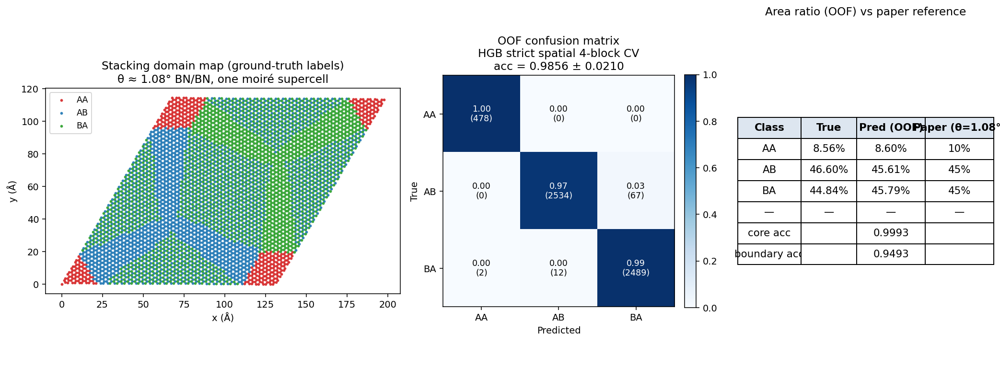
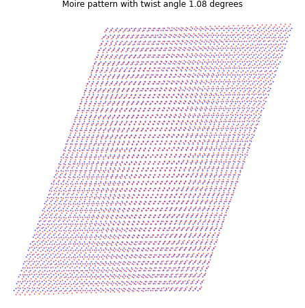
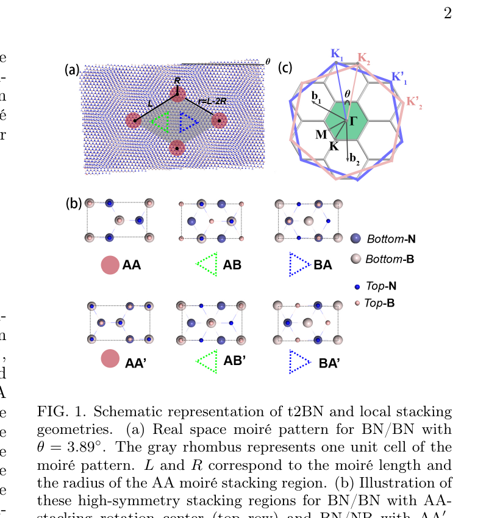
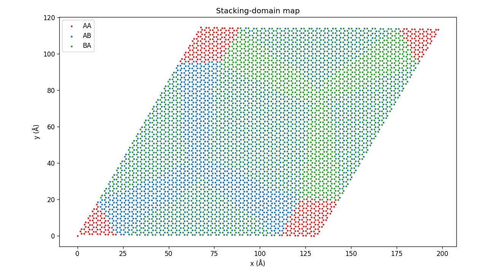
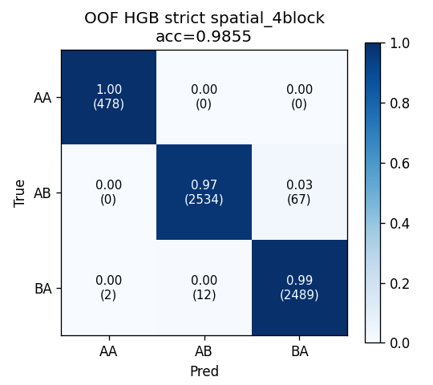
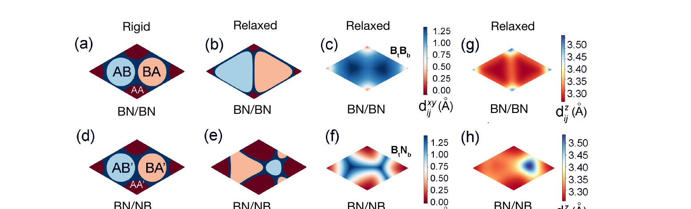
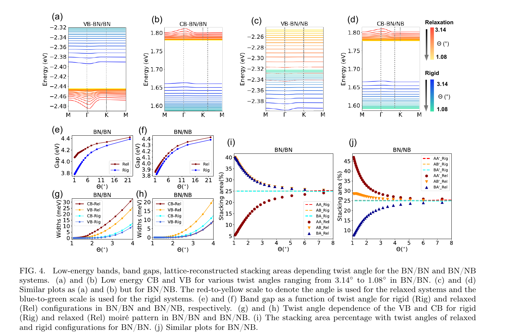
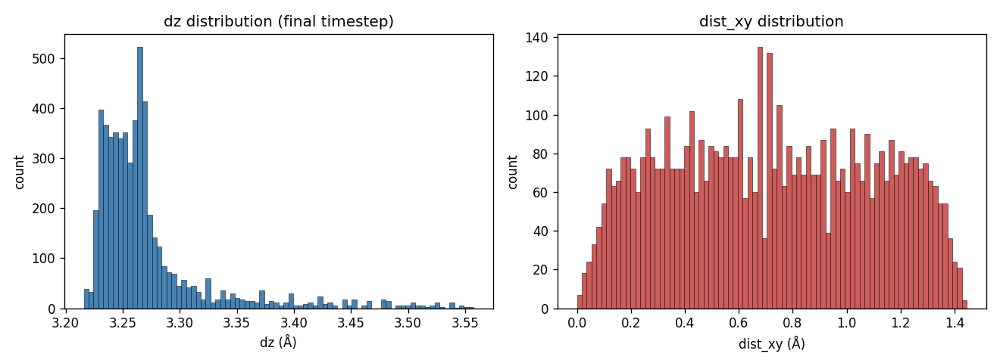
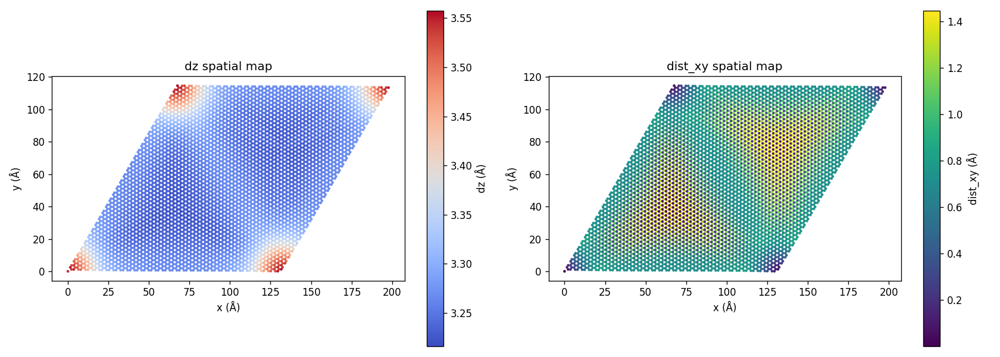
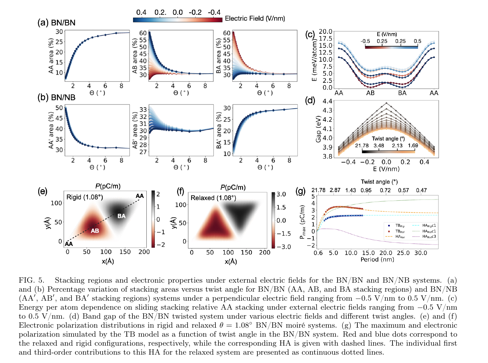

# 트위스트 2D 물질의 stacking domain 자동 분류

> **수천 개 원자 좌표만 보고, 어느 위치가 어떤 결정 구조 (AA / AB / BA) 인지 자동으로 알려주는 ML 파이프라인.**



| | |
|---|---|
| **무엇** | 트위스트 이중층 h-BN (θ ≈ 1.08°) 의 LAMMPS 시뮬레이션 좌표 → AA / AB / BA 도메인 자동 분류 |
| **결과** | spatial 4-block CV **98.56 % ± 2.10 %**, 면적비가 [Li et al. 2024 Fig 4(i)](https://arxiv.org/abs/2406.12231) 와 정량 일치 |
| **포인트** | 라벨 입력 feature 전부 제외해도 (strict track) 동일 성능 — **leakage 없음 직접 증명** |

---

## 1. 30 초 요약 — 무엇을 했나

### 1.1 어떤 시스템

**h-BN (질화붕소) 층 두 장을 살짝 비틀어 겹친 구조**.

겹친 각도가 작으면 (θ ≈ 1°) 큰 무늬가 생긴다. 이걸 **모아레 패턴** 이라고 한다.

| 본 프로젝트 — 한 개 모아레 셀 | 논문 — AA / AB / BA 정의 |
|------------------------------|--------------------------|
|  |  |

모아레 셀 안의 위치마다 **두 층의 정렬 방식이 다르다**.

- **AA**: 같은 원자 (B 위 B, N 위 N) 직상 정렬. 에너지 높음, 영역 좁음.
- **AB**: 위층 B 가 아래층 N 직상. 안정. 영역 넓음.
- **BA**: 위층 N 이 아래층 B 직상. AB 의 거울 대칭. 안정.

→ 이 도메인 분포가 **전자/광학 특성을 결정**.

### 1.2 왜 ML 인가

도메인 식별을 사람이 손으로 하는 게 표준이었다. 시스템마다 임계값 재튜닝. 전기장·각도 스윕 시 수십 ~ 수백 구성 → 수작업 불가.

→ ML 로 자동화.

### 1.3 핵심 결과

- 라벨 입력 feature **전부 제외** 한 모델로 **98.56 %**.
- AA / AB / BA 면적비가 논문 θ = 1.08° 값과 **1 pp 이내 일치**.

---

## 2. 결과 한눈에

### 도메인 맵 — 라벨 (left) vs 모델 예측 (right)

| Ground-truth | OOF 예측 (HGB strict spatial) |
|---|---|
|  |  |

4 꼭짓점 빨강 = AA, 큰 파랑 삼각 = AB, 큰 녹색 삼각 = BA. 오류는 거의 AB ↔ BA 경계만.



*논문 Fig 3 (b) BN/BN relaxed map 과 토폴로지 동일.*

### 면적비 — 논문과 정량 매칭

| 라벨 | 본 모델 (OOF) | 논문 θ=1.08° |
|---|---|---|
| AA | 8.60 % | ≈ 10 % |
| AB | 45.61 % | ≈ 45 % |
| BA | 45.79 % | ≈ 45 % |



*논문 Fig 4 (i). θ ≈ 1.08° 부근의 AA / AB / BA 비율과 본 모델 OOF 예측이 직접 일치.*

### 평가 표

| Model | Track | Overall | Core | Boundary |
|---|---|---|---|---|
| **HGB** | **strict** | **0.9856 ± 0.0210** | **0.9993** | **0.9493** |
| HGB | species_aware | 0.9856 ± 0.0186 | 0.9991 | 0.9501 |
| RF | strict | 0.9775 ± 0.0268 | 1.0000 | 0.9180 |
| RF | leakage_upper *(진단)* | 0.9809 ± 0.0308 | 1.0000 | 0.9302 |

> **핵심**: strict (라벨 정보 0) ≈ leakage_upper (라벨 정보 다 포함) → leakage 없음.

---

## 3. 파이프라인 (4 단계)

```
LAMMPS dump  ──►  Phase 0  EDA / PBC-aware pairing
                          ↓
                   Phase 1  Labeling  (type_pair + dz + sector + smoothing)
                          ↓
                   Phase 2  3-track features (strict / species_aware / leakage_upper)
                          ↓
                   Phase 3  RF + HGB + rule baselines
                          ↓
                          metrics + figures
```

### Phase 0 — 데이터 확인

| dz 분포 | 공간 색맵 |
|---|---|
|  |  |

- dz bimodal: 3.23~3.27 Å (AB/BA) + 3.30~3.55 Å 꼬리 (AA).
- 모아레 셀 corner 에 AA hotspot.

**또 하나 발견**: 입력 파일은 `θ = 6°` 라고 적혀 있는데, dump 의 cell geometry 실제 계산하면 **θ = 1.0841°**. Input 파일 stale. Dump 신뢰. 데이터 검증의 시작.

### Phase 1 — 라벨링

각 아래층 원자에 대해 **위층의 가장 가까운 원자** 를 찾는다 (PBC 처리 = 박스 가장자리도 반대편과 연결된 척 처리).

라벨 규칙은 **물리 정의** 그대로:

| 위치 | 위에 있는 위층 원자 | 라벨 |
|---|---|---|
| AA core | 같은 종 (B 위 B / N 위 N) + 큰 dz | **AA** |
| AB core | bot-N 위 top-B | **AB** |
| BA core | bot-B 위 top-N | **BA** |

→ 면적비 = AA 8.4 / AB 46.1 / BA 45.5. 논문 값과 1 pp 이내 일치 → 라벨 신뢰.

### Phase 2 — Feature engineering (3-track)

라벨 만들 때 쓴 feature 를 학습 input 에 그대로 넣으면 → 모델이 라벨 규칙 외움 = 가짜 100 %.

**3-track 으로 명시적 비교**:

| Track | Feature 수 | 라벨 입력 feature |
|---|---|---|
| **strict** | 20 | 전부 제외 |
| species_aware | 30 | 종 정보만 간접 허용 |
| leakage_upper | 37 | 전부 포함 *(진단용)* |

### Phase 3 — 모델링

- **RF + HGB** (둘 다 tabular 표준)
- **Random 5-fold + Spatial 4-block CV** (random 은 over-optimistic 진단용)
- **Overall / Core / Boundary** 별도 평가

---

## 4. 핵심 의사결정

면접 시 자주 받는 질문 5 가지 + 답.

### Q1. 왜 도메인 분류가 필요한가

t2BN 의 **거의 모든 물리량이 도메인 분포로 결정**.

| 물리량 | 도메인 의존성 |
|---|---|
| Flat band 폭 | AA / AB / BA 면적 비율 |
| Band gap | AA 면적 |
| 강유전 분극 | AB / BA 의 dipole 반대 부호 |
| 전기장 응답 | AB / BA 면적 비대칭 변화 |
| 인접 물질 moiré potential | 도메인 분포 |

→ 도메인 = physics output 의 시작점. 분류 안 하면 분석 불가.

### Q2. 왜 ML 인가 (임계값으로 풀리지 않나)

- **시스템마다 임계값 재튜닝 불필요**: twist angle / E-field 바뀌면 분포 변화
- **High-throughput sweep**: 수십~수백 구성 자동 처리
- **Boundary 정량화**: rule = hard cutoff, ML = soft probability → soliton 영역 불확실성 측정
- **간접 descriptor 학습**: 직접 registry feature 없이도 (예: intralayer 변형 흔적) 도메인 복원 → 새 물리 인사이트

### Q3. PBC 가 뭔가

**Periodic Boundary Conditions (주기 경계 조건)**.

박스의 한쪽 끝이 반대편과 물리적으로 연결된 척 처리.

```python
# 위층 atom 을 3x3 image grid 로 복제
for ia in (-1, 0, 1):
    for ib in (-1, 0, 1):
        shift = ia * A + ib * B           # A, B = 격자 벡터
        replicated.append(top_xy + shift)
tree = cKDTree(replicated)                 # 9N 점에 트리
distance, idx = tree.query(bot_xy, k=1)
```

→ 박스 가장자리 atom 의 nearest neighbor 가 반대편 image 인 경우도 정확히 처리.

### Q4. 라벨링 — 왜 그렇게

**시행착오 4 단계**:

| 시도 | 결과 | 폐기 이유 |
|---|---|---|
| KMeans k=3 | 클러스터 불명확 | 검증 불가 |
| Voronoi 3-center | AA = 55 % | 논문 10 % 와 큰 차이 |
| dz + 6-sector hybrid | AA 10 % 맞지만 spatial map 혼재 | 도메인 안 보임 |
| **type_pair + dz + sector** | **AA 8.4 / AB 46.1 / BA 45.5** | **채택** |

**채택 이유 — 5 중 검증**:

1. Paper Fig 1(b) 의 AA/AB/BA 정의를 type_pair 로 1:1 인코딩
2. 면적비 = 논문 값과 1 pp 이내
3. Sector 분포 = `[613, 127, 613, 127, 613, 127]` (완벽한 alternation)
4. Spatial map 토폴로지 = 논문 Fig 3(b)
5. Boundary atom 이 soliton 네트워크 따라 분포 = 논문 Fig 3 relaxed topology

### Q5. Feature engineering — 왜 3-track

**Strict 단일 track 만 보고하면 약점**:
- "라벨 정보 다 빼면 ML 이 뭐 할 수 있나?"
- "직접 정보 다 주면 얼마 나오나?"

**3-track 으로 명시 비교**:

- **strict (98.56 %)** ≈ **leakage_upper (98.09 %)** → 라벨 없이 동등 = leakage 없음 직접 증거
- species_aware = strict 와 동등 (약간 낮음) → 종 정보 일반화에 도움 안 됨 (정직)

**Strict feature 핵심**:
- 아래층 6-fold 대칭 변형 (`bot_ang_gap_std`)
- 아래층 z puckering (`z_bot`)
- 인근 top atom 의 z 통계 (`top_z_mean_5nn`)
- 2 ~ 5번째 nearest top 거리 (1번째는 라벨에 썼으므로 제외)

→ 라벨러가 본 정보 (nearest pair) 와 모델이 본 정보 (이웃 통계) 거의 안 겹침.

### Q6. RF + HGB 선택 이유

- **Tabular 데이터 → tree-based 표준**
- **Feature importance 해석 가능 → 물리 인사이트 (intralayer 변형 흔적) 설명**
- **Sklearn 표준 → 종속성 0, training 수 초**
- HGB 가 spatial CV 에서 RF 보다 우수 (98.56 % vs 97.75 %, fold std 도 작음)
- 다른 모델: GNN / MLP / CNN / SVM 은 데이터 양·구조 부적합

---

## 5. Top features 의 물리 해석

| 순위 | Feature | 중요도 |
|---|---|---|
| 1 | `bot_ang_gap_std` | ≈ 25 % |
| 2 | `z_bot` | ≈ 11 % |
| 3 | `top_z_mean_5nn` | ≈ 9 % |
| 4 | `top_zminus_bot_mean` | ≈ 9 % |
| 5 | `top_dist_3` | ≈ 8 % |

> stacking domain 은 interlayer registry 만 바꾸는 게 아니라 **intralayer lattice relaxation 에도 흔적** 을 남긴다. ML 이 그 흔적으로부터 도메인 복원. Paper 의 "lattice relaxation effect" 주장을 ML 측에서 검증.

---

## 6. Future Work (sweep 데이터 확보 후)

본 파이프라인은 dump 만 받으면 동일 코드 흐름으로 작동.



1. **Twist angle sweep** → Paper Fig 4(i) 의 stacking area 곡선 (1° ~ 8°) 자동 추출
2. **Electric field sweep** → Paper Fig 5(a) 의 비대칭 응답 재현
3. **BN/NB 정렬** → 라벨러의 cross-sub pair convention 재정의만 필요
4. **Cross-system CV** → 여러 시스템 합쳐 fold 묶으면 진짜 일반화 평가 가능

---

## 7. 한계 (솔직)

- 단일 θ = 1.08° BN/BN MVP. Cross-system / sweep 평가 미수행.
- 라벨러는 Paper 본문 정의 부합 / Supplemental Fig S.5 polygon exact 재현 아님.
- Boundary 95 % (core ≈ 100 %) — soliton 영역 약점.
- species_aware ≤ strict — 종 정보 일반화에 도움 안 됨.
- Rule baseline 37 % 는 rule 결함이 아니라 ML 이 smoothing 까지 학습한 결과.
- Force field 정확도 상속. DFT 보장 아님.

---

## 8. 재현

```bash
pip install -r requirements.txt

python3 scripts/run_labeling.py          # dump → labeled pairs
python3 scripts/build_features.py        # 3-track features
python3 scripts/train_eval.py            # RF + HGB + rules → metrics + figures
python3 scripts/make_headline_figure.py  # headline composite
```

---

## 9. 디렉토리

```
src/        labeling.py, features.py, models.py
scripts/    run_labeling.py, build_features.py, train_eval.py, make_headline_figure.py, crop_paper_figs.py
data/       hbn_lammps_dump.dat, processed/ (gitignored)
eda/        00_box.py … 06_label_typepair.py (탐색 흔적)
img/
  visualization/  EDA 그림, label 그림, confusion matrix
  paper/          논문 Fig 1 / 3 / 4 / 5 crops
  result/         poster, architecture, headline
requirements.txt, README.md
```

---

## 10. 참고문헌

1. Li, F., Lee, D., Leconte, N., Javvaji, S., & Jung, J. (2024). *Moiré flat bands and antiferroelectric domains in lattice relaxed twisted bilayer hexagonal boron nitride under perpendicular electric fields*. [arXiv:2406.12231](https://arxiv.org/abs/2406.12231).
2. Naik, S. et al. (2022). *Twister*. SoftwareX.
3. Plimpton, S. (1995). *LAMMPS*. J. Comp. Phys. 117, 1.
4. Wen, M. et al. (2018). DRIP. Phys. Rev. B 98, 235404.
5. Los, J. et al. (2017). ExTeP. Phys. Rev. B 96, 184108.
